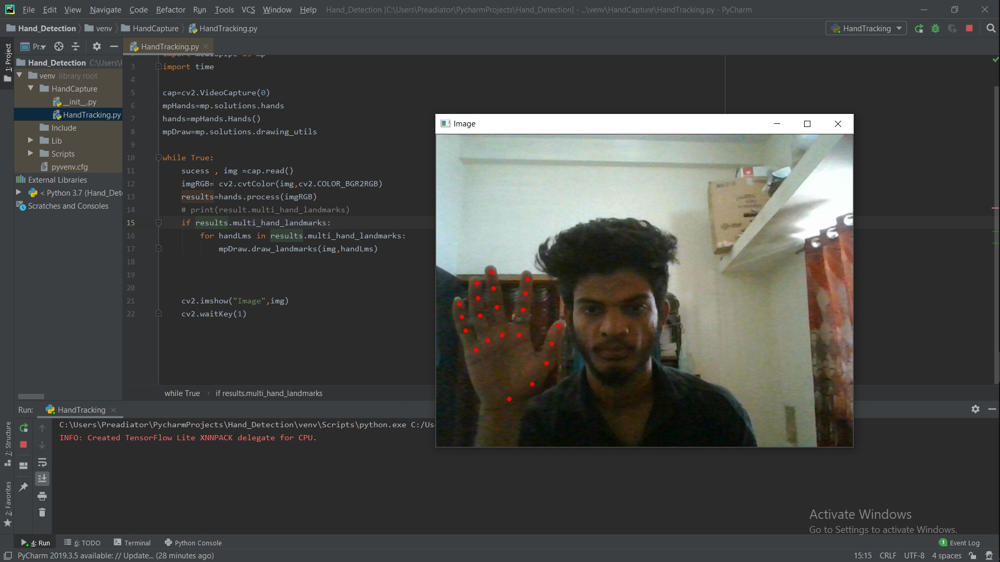
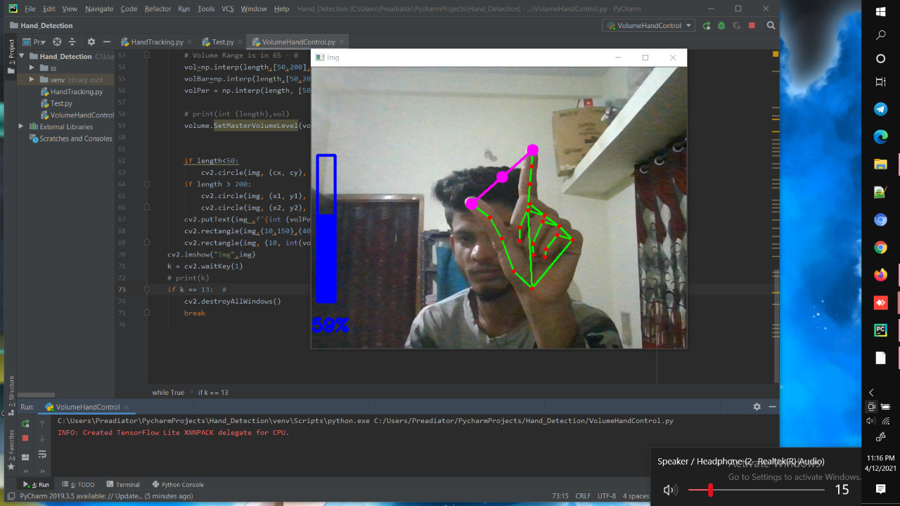
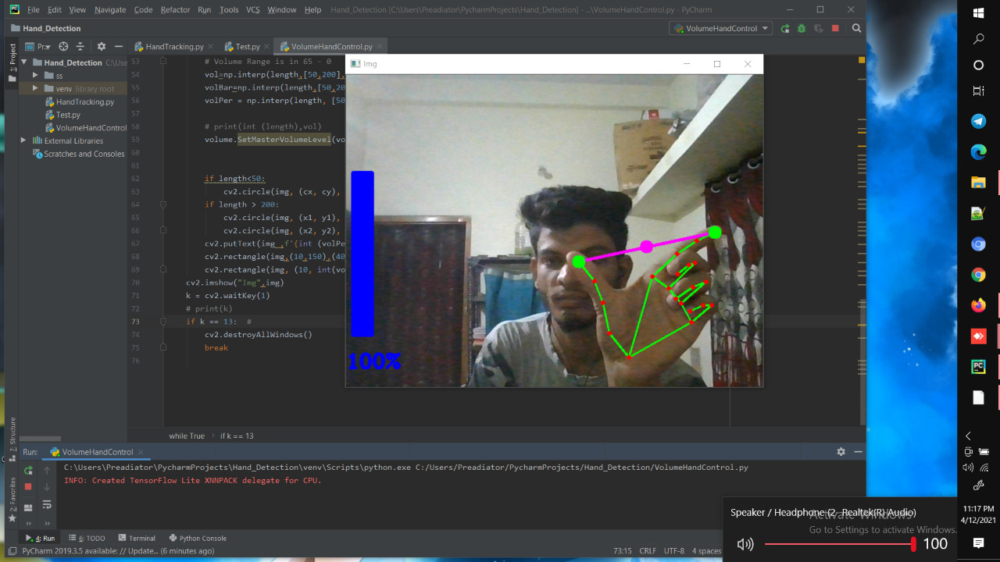

# Hand_Gesture_Voice_Control
In this project we have used MediaPipe library for Hand Detection, which uses tensorflow lite in backend.

The [Hand Tracking](HandTracking.py) is the file which contains some Functions about Hand Points Detection 


<hr>
**Library Used:**

- 👨 MediaPipe:
    * ***MediaPipe*** offers customizable Python solutions as a prebuilt Python package on PyPI, which can be installed simply with ``` pip install mediapipe ```. It also provides tools for users to build their own solutions. Please see [MediaPipe in Python](https://google.github.io/mediapipe/getting_started/python) for more info.
- 🚀 OpenCV
    * ***OpenCV*** is a library of programming functions mainly aimed at real-time computer vision.
- 💬 Pycaw
    * ***Pycaw*** is the library having the support in python to manuplate the volume. For that it has provided some functions.
- 📝 Numpy
    * ***Numpy*** is a library for the Python programming language, adding support for large, multi-dimensional arrays and matrices, along with a large collection of high-level mathematical functions to operate on these arrays.

[VolumeHandControl](VolumeHandControl.py) is the file which have the logiic to contorl the volume using the functions of the HandTracking.py .



<hr>


